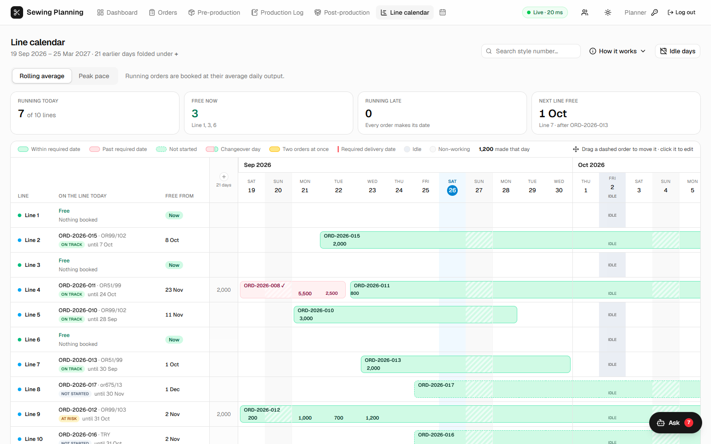
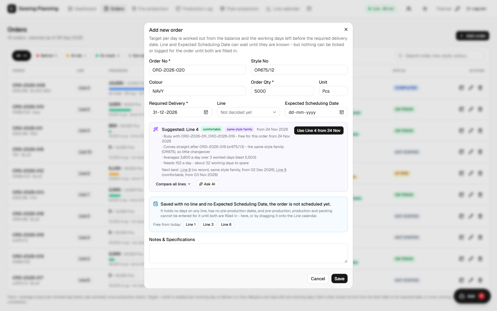
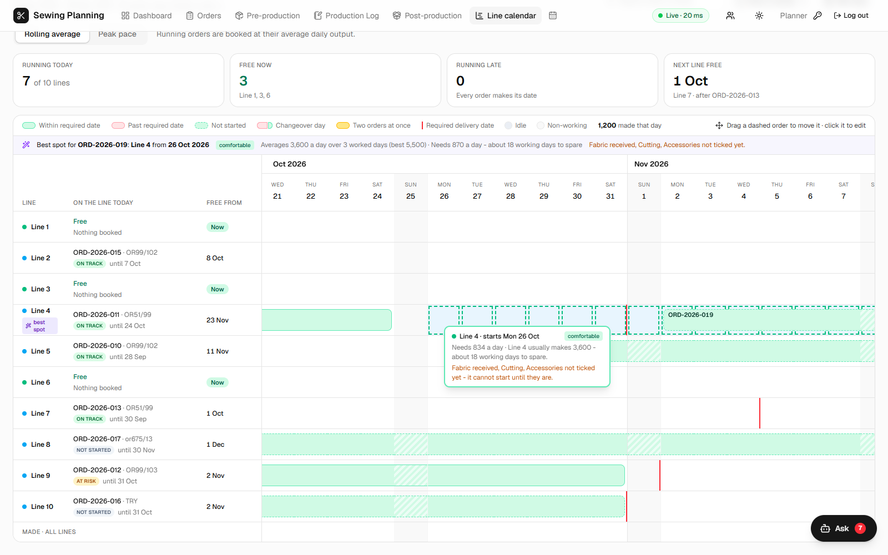
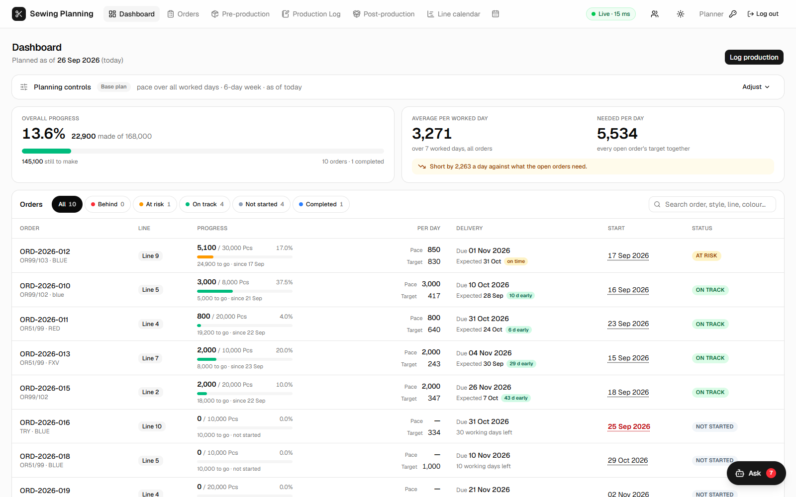
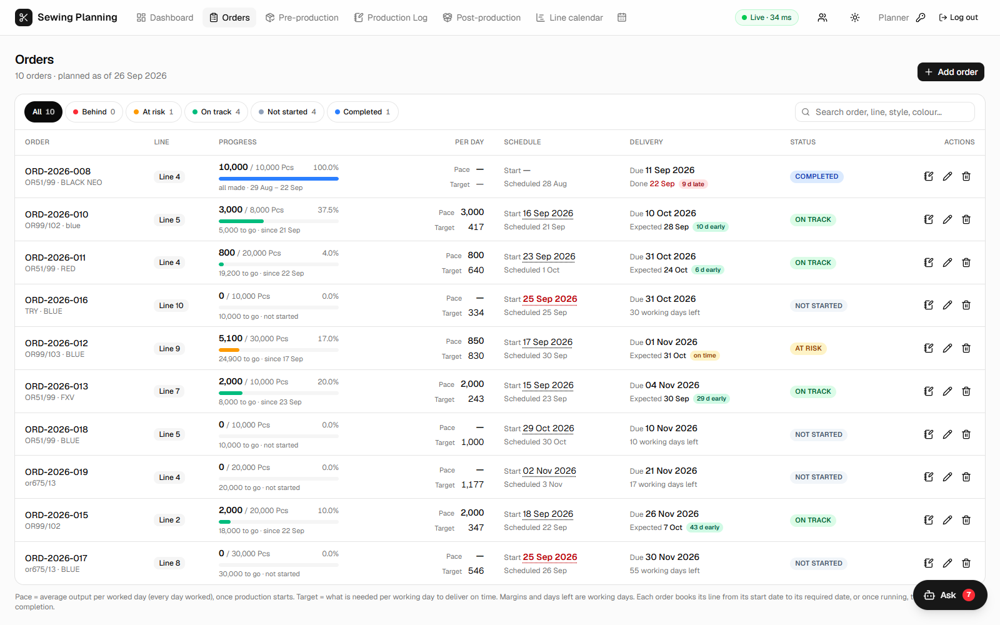
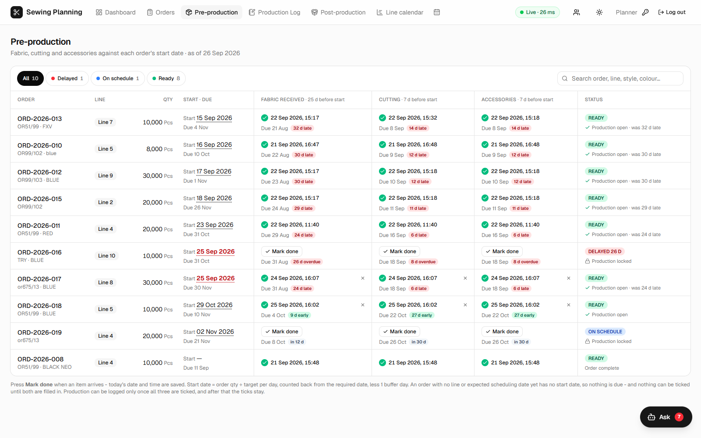
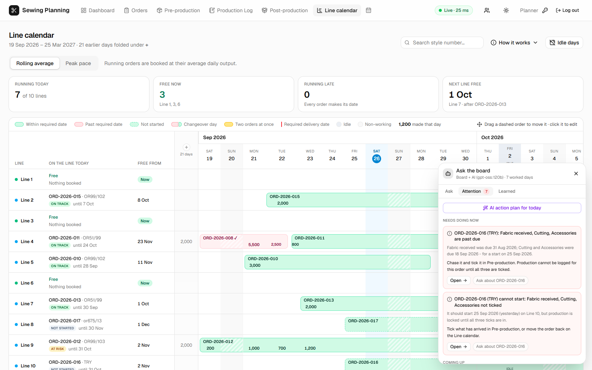

# Sewing Planning System

**Production planning for a garment factory's sewing floor: orders booked onto ten sewing lines, the daily production log, pre- and post-production tracking, a drag-and-drop line calendar, and an advisor that says which line an order should go on - judged by what each line has really made. Every figure is worked out from the same stored facts on every read, so no two screens can ever disagree.**


<p align="center"></p>

> In daily use at a knitted-apparel manufacturer, running as Windows services behind a Cloudflare tunnel. Screenshots are from a copy of the live board. Server details, the production database and its data are not part of this repository.

---

## Why it exists

The factory planned its sewing lines in an Excel workbook with macros. It worked until it didn't: pace was averaged over individual log rows, so a day with a Day and a Night entry counted twice and halved it; the target per day was a number someone typed; orders past their delivery date still read *NOT STARTED*; and the formulas covered 55 orders while the macros allowed 60, so the last ones silently vanished. Nothing told a planner that the line they had just picked was busy until the 28th.

This app keeps what people type - orders, production, ticks - and **derives everything else**, the same way, every time it is read.

## What is in it

| Page | What it answers |
|---|---|
| **Dashboard** | How far along the factory is, what it makes a day against what the open orders need, and every order at a glance |
| **Orders** | Each order's line, progress, pace against target, start, delivery and status - with an advisor in the order form |
| **Pre-production** | Fabric, cutting and accessories against each order's start date - early, late, overdue - and whether production is unlocked |
| **Production Log** | One entry per order, day and shift, with running totals and confirmations for over-production and duplicate shifts |
| **Post-production** | Packing, due four days after an order is complete |
| **Line calendar** | Who holds each line on each day, what was made, and drag-and-drop to move orders that have not started |
| **Production calendar** | Every order by day, each day coloured against what the order needed that morning |
| **Ask** (every page) | An assistant that answers questions from the board and raises what needs attention |

## The rule that holds it together: derive, don't store

Only what people type is stored. Produced, balance, pace, target per day, start date, expected completion, buffer, status and every line booking are **computed on every read** by one module, `backend/src/planning.ts`, which touches no database and is covered by the test suite. The browser never calculates a number itself.

```
order          qty, required delivery date, line, expected scheduling date
+ production   what was made, per order, per day, per shift
+ idle days    holidays, power cuts, half days - per line or for all
= pace         average of DAILY totals over the days actually worked
= target/day   balance ÷ working days left before the required date
= start date   qty ÷ target, counted back from the required date, less a buffer day
= booking      the days the order holds its line - and the queue behind it
= pre-production due dates, packing date, status, buffer
```

Change a required date, log a slow day or mark a holiday, and every screen - the start date, the target, the fabric due date, the next order waiting on that line - moves at once, with nothing to migrate.

## Order to line, end to end

1. **Take the order.** Qty and required delivery date are enough. The line and the expected scheduling date can wait until they are known; until both are there the order is *not scheduled* - it holds no line, and nothing can be ticked or logged against it (the API refuses, and each page explains with a popup).
2. **Place it.** As the form is filled in, the **advisor** ranks all ten lines and one click takes its pick - the line and the date it comes free.
3. **Book it.** An order not started books its line from its start date to its required date. A clash with another order is refused on save, inside a transaction, with the day the line is free and the lines that are free now.
4. **Prepare it.** Fabric is due 25 days before the start, cutting and accessories 7. Production stays locked until all three are ticked.
5. **Make it.** Each day's output re-times the order: a running order holds its line until its balance is done at its real pace, so a faster pace frees days for the next order and a slower one pushes the queue behind it back.
6. **Pack it.** Packing is due four days after the last piece.

## The advisor

`backend/src/advisor.ts` judges every line for an order the way a planner would - not just *is it free*, but *will it make the date*:

- the earliest the order can start on that line, and what it would then need per day;
- against that line's **own record**: its average and best day - for this style on this line when it has run it before;
- a fit - **comfortable / tight / a stretch / beyond its record / no record** - with working days to spare.

**Style families come first.** The part of a style number before the `/` is its family (`OR675/11` and `OR675/12`). A line already running that family - or holding it straight before or after where the order would go - is set up for it, so it is ranked first as long as it can still make the date. The family's record also stands in for a style the line has not made before.

It shows up where the work is done: in the order form (the pick, its reasons, *Use Line 4 from 24 Nov*, every line side by side, and warnings such as a target no line has ever reached), and on the line calendar - the moment an order is picked up, the best spot is marked, and every day it is dragged over is judged beside the cursor.

<p align="center"></p>

## The assistant

An **Ask** button sits at the bottom right of every page:

- **Ask** - questions in plain words (*When will ORD-2026-011 finish? Which lines are free? Where can I put 5,000 pieces by 20 Dec?*), answered by the same functions that draw the screens, so an answer cannot disagree with the board. Every answer says how it read the question; one it cannot place, it says so.
- **Attention** - what the board would raise, ranked urgent / coming up / worth knowing, each with its figures and what to do: a milestone past due, an order that will miss its date and the pace it would take, a target no line has reached, a line standing free while an order waits elsewhere.
- **Learned** - what each line and style really makes, how much a day swings, and how a new order builds up over its first days. Statistics from the logged days, not a trained model: a factory this size logs tens of days, and every figure can be traced to the entries behind it.

Optionally, an **AI model** (Ollama, `gpt-oss:120b`) writes on top: explanations, a daily action plan, a second opinion in the order form. It is handed a written brief of the board and told to use only the board's figures; its answers are labelled as the model's, beside the board's own. The board's answers work with it switched off.

## Screenshots

| | |
|---|---|
|  |  |
| **Dragging an order** - the best spot is named above the grid and marked on its line; the day under the cursor is judged | **Dashboard** - progress, average against need, and every order |
|  |  |
| **Orders** - progress, pace against target, schedule, delivery | **Pre-production** - each milestone against its due date |
|  |  |
| **Assistant** - what needs attention, and why | **Line calendar** - bookings, output per day, changeovers |

### Behaviour that is easy to miss

- **A day with nothing logged is not a zero.** Pace averages the days actually worked; a half idle day counts as half a day, so its short output is not read as a slow day.
- **The queue re-plans itself.** When work on a line runs over, the next order on it waits, and its start date, target and fabric due date move with it - its start reads *after ORD-…*.
- **Changeovers are not clashes.** One order finishing and the next starting on the same day splits that day on the line calendar in proportion to what each made.
- **Two ways to read pace.** The line calendar can book running orders at their rolling average (the plan every page uses) or at their peak - the target for the first four days, then the best day so far - to see what a line could free up.
- **Per-viewer planning controls.** Pace over the last N days, a 5/6/7-day week or an earlier as-of date re-plan every screen - for that viewer only, never saved.
- **Moving an order moves everything.** Drop a not-started order on another line or day and its scheduling date, start, target and pre-production dates follow; the required date stays.

## How it is built

```
browser ──► Next.js 16 (port 3100) ── /api/* ──► Express 5 API (port 4000) ──► PostgreSQL
            React 19, shadcn/ui on Base UI,        planning.ts   advisor.ts         10 migrations
            Tailwind 4, SWR (10 s refresh)          insights.ts   assistant.ts       applied on start
                                                    ai.ts ─► Ollama (optional)
```

- **One address.** The browser only talks to Next.js, which proxies `/api/*` to the API - no cross-origin setup.
- **Several people at once.** Every save goes straight to PostgreSQL; every open screen re-reads every 10 seconds and on returning to the tab; API responses are `no-store`. Line bookings are checked under a transaction-scoped advisory lock, so two people cannot book the same days at the same moment.
- **Hosting.** Two Windows services run the API and the web app through a small C# service host (`service/SewingHost.cs`) that restarts them if they stop; a Cloudflare tunnel publishes the site. Web updates go out with no outage: the new build is made beside the running one, tried on a spare port, then switched to in about a second, with automatic rollback. See [docs/hosting.md](docs/hosting.md).

### Security

- **Server-enforced permissions.** Users hold roles; roles are sets of view / edit permissions per page. Every API route checks them - the pages only hide what a user cannot use.
- Passwords are stored as **scrypt** hashes; sessions are **HMAC-signed** cookies. Ten wrong passwords from one address lock it out for 15 minutes. Deactivating a user or resetting a password signs them out everywhere at once.
- Accounts are deactivated, never deleted, and the last administrator cannot be locked out.
- **No secrets in source**: the database URL, session secret and AI key come from `backend/.env`.

## Tests

```
cd backend && npm test        # 101 tests
```

The planning rules (including the workbook's own three orders, checked against the sheet), line booking and the queue, idle days, peak pace, moves, the not-scheduled rules, the advisor and style families, the assistant's answers and suggestions, sign-in and sessions, and the AI plumbing with the network mocked. Changes are also run end to end against a copy of the live database before they go out.

## Getting started

Needs Node.js 20+ and PostgreSQL.

```bash
cd backend
cp .env.example .env          # put your PostgreSQL password in DATABASE_URL
npm install
npm run set-login -- Admin "choose-a-password"   # first administrator (and the session secret)
npm run dev                   # API on http://localhost:4000 - creates the tables on first start

cd ../frontend
npm install
npm run dev                   # open http://localhost:3100
```

`npm run import -- "<workbook.xlsm>"` loads orders and production from the original Excel workbook.

## Project layout

```
backend/
  src/planning.ts     every rule and every derived figure - no database, fully tested
  src/advisor.ts      which line an order should go on, and why
  src/insights.ts     what the board learns from the log, and what it raises
  src/assistant.ts    plain-language questions answered from the board
  src/ai.ts           the optional AI model: the brief it is given, and its guard rails
  src/server.ts       the API: validation (zod), permissions, transactions
  migrations/         the schema, one SQL file per change
  test/               the test suite
frontend/
  src/app/            one folder per page
  src/components/     order form, advisor card, assistant panel, shared cells
  src/lib/            API types and hooks, the drag verdict
service/              Windows service host, installer, no-outage deploy, health check
docs/                 how it works in detail, hosting, screenshots
```

More detail: [docs/how-it-works.md](docs/how-it-works.md) - every planning rule, roles and permissions, and what changed from the workbook on purpose.

---

<sub>Author: <a href="https://github.com/Sharmaji12369">Srijan Sharma</a>. Shared as a portfolio piece; the production database, server configuration and live data are not included.</sub>
